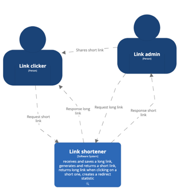
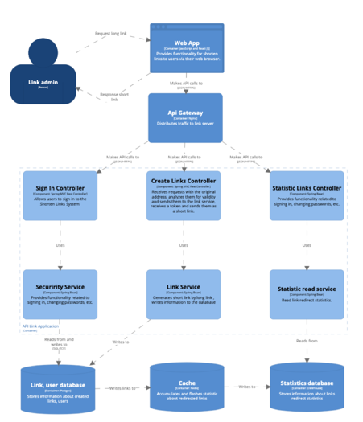
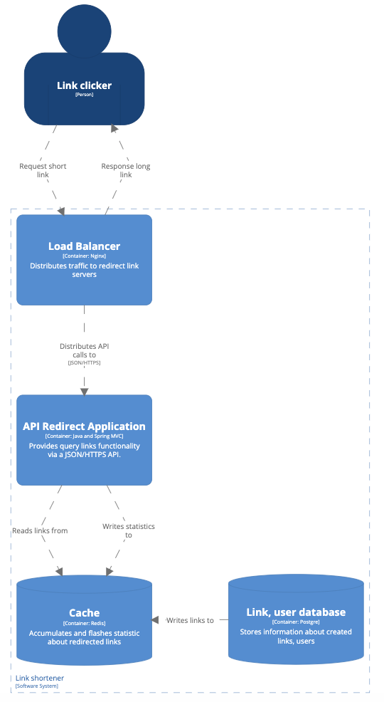

# Link shortener
App for shorten users links and create links redirect statistic

## Diagrams
* system context diagram

* link service container and component diagram

* redirect service container diagram

## Modules:
* [commons](commons)
- location of data common to other modules
* [link-service](link-service)
- accepts requests with the original address, analyzes them for validity and sends them to the link service, 
receives a token and sends them as a short link
- obtaining link statistics for fields of interest to the user
- user authorization and authentication
* [redirect-service](redirect-service)
- accepts a request with a short link, parses it into a token and sends it to the link service, receives a long link 
and sends it back